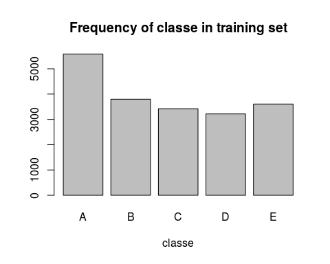

Introduction
------------

In this project, we are to analyse data collected from some
accelerometers attached on apparatus or the body of 6 participants. The
data will be used to predict how well these participants did their
exercise. The data provided are extracted from
<http://groupware.les.inf.puc-rio.br/har>, and are already divided up to
a training set and a test set.

Data Pre-processing
-------------------

Load the data.

    library(caret, quietly=TRUE)
    library(curl)
    #url_train <- curl('https://d396qusza40orc.cloudfront.net/predmachlearn/pml-training.csv')
    #url_test  <- curl('https://d396qusza40orc.cloudfront.net/predmachlearn/pml-testing.csv')
    url_train <- './pml-training.csv'
    url_test  <- './pml-testing.csv'
    pml_train <- read.csv(url_train)
    pml_test  <- read.csv(url_test)

Remove columns with NA strings, including "NA", "\#DIV/0!", and "".

    train_cln <- pml_train
    train_cln[train_cln=='#DIV/0!'] <- NA
    train_cln[train_cln=='']        <- NA
    train_cln <- train_cln[, colSums(is.na(train_cln))==0]

Inspect the data with *str(train\_cln)*, notice some of the variables
are not suitable for the model building, such as timestamps/window
variables, and need to be removed. All the rest of the variables are
already correctly cast into numeric form by R, thus no need to do type
casting.

    train_tag <- grepl('^X|timestamp|window', names(train_cln) )
    train_cln <- train_cln[, !train_tag]
    #str(train_cln)

Do the same to the test data.

    test_cln <- pml_test
    test_cln[test_cln=='#DIV/0!'] <- NA
    test_cln[test_cln=='']        <- NA
    test_cln <- test_cln[, colSums(is.na(test_cln))==0]
    test_tag <- grepl('^X|timestamp|window', names(test_cln) )
    test_cln <- test_cln[, !test_tag]

Then, the cleaned training data set is sliced into two partitions of
training set and validation set with 70/30 rule.

    library(caret, quietly = T)
    set.seed(12345)
    partition <- createDataPartition(train_cln$classe, p=0.7, list=FALSE)
    training  <- train_cln[partition,]
    testing   <- train_cln[-partition,]

Exploratory
-----------

The frequency of observations for the five types of classe are roughly
evenly distributed, which is a good sign,

    barplot(table(train_cln$classe), xlab='classe', main='Frequency of classe in training set')

Building Model
--------------

We use a random forest algorithm to fit the training dataset. Usually
the random forest method is robust enough to cater for classification
problems with roughly same number of observations of all the classes.

    rf_config <- trainControl(method='cv', number = 5, allowParallel=T)
    rf_model  <- train(classe ~ ., data=training, method='rf', trControl=rf_config)

    ## Loading required package: randomForest
    ## randomForest 4.6-10
    ## Type rfNews() to see new features/changes/bug fixes.

    rf_model

    ## Random Forest 
    ## 
    ## 13737 samples
    ##    53 predictor
    ##     5 classes: 'A', 'B', 'C', 'D', 'E' 
    ## 
    ## No pre-processing
    ## Resampling: Cross-Validated (5 fold) 
    ## Summary of sample sizes: 10989, 10990, 10990, 10989, 10990 
    ## Resampling results across tuning parameters:
    ## 
    ##   mtry  Accuracy   Kappa      Accuracy SD   Kappa SD    
    ##    2    0.9909733  0.9885804  0.0017528945  0.0022175592
    ##   29    0.9907550  0.9883050  0.0012760475  0.0016140340
    ##   57    0.9856592  0.9818573  0.0007547472  0.0009543554
    ## 
    ## Accuracy was used to select the optimal model using  the largest value.
    ## The final value used for the model was mtry = 2.

    rf_model$finalModel

    ## 
    ## Call:
    ##  randomForest(x = x, y = y, mtry = param$mtry) 
    ##                Type of random forest: classification
    ##                      Number of trees: 500
    ## No. of variables tried at each split: 2
    ## 
    ##         OOB estimate of  error rate: 0.74%
    ## Confusion matrix:
    ##      A    B    C    D    E class.error
    ## A 3901    2    2    0    1 0.001280082
    ## B   19 2632    7    0    0 0.009781791
    ## C    0   24 2370    2    0 0.010851419
    ## D    0    0   37 2212    3 0.017761989
    ## E    0    0    0    5 2520 0.001980198

Then the performance of the random forest model is tested using the
validation dataset.

    rf_validate <- predict(rf_model, testing)
    rf_conf_mat <- confusionMatrix(rf_validate, testing$classe)
    rf_conf_mat

    ## Confusion Matrix and Statistics
    ## 
    ##           Reference
    ## Prediction    A    B    C    D    E
    ##          A 1673   12    0    0    0
    ##          B    1 1121   16    0    0
    ##          C    0    6 1005   24    0
    ##          D    0    0    5  940    4
    ##          E    0    0    0    0 1078
    ## 
    ## Overall Statistics
    ##                                          
    ##                Accuracy : 0.9884         
    ##                  95% CI : (0.9854, 0.991)
    ##     No Information Rate : 0.2845         
    ##     P-Value [Acc > NIR] : < 2.2e-16      
    ##                                          
    ##                   Kappa : 0.9854         
    ##  Mcnemar's Test P-Value : NA             
    ## 
    ## Statistics by Class:
    ## 
    ##                      Class: A Class: B Class: C Class: D Class: E
    ## Sensitivity            0.9994   0.9842   0.9795   0.9751   0.9963
    ## Specificity            0.9972   0.9964   0.9938   0.9982   1.0000
    ## Pos Pred Value         0.9929   0.9851   0.9710   0.9905   1.0000
    ## Neg Pred Value         0.9998   0.9962   0.9957   0.9951   0.9992
    ## Prevalence             0.2845   0.1935   0.1743   0.1638   0.1839
    ## Detection Rate         0.2843   0.1905   0.1708   0.1597   0.1832
    ## Detection Prevalence   0.2863   0.1934   0.1759   0.1613   0.1832
    ## Balanced Accuracy      0.9983   0.9903   0.9867   0.9866   0.9982

The overall accuracy indicated from the confusion matrix is 0.9884,
which is very good.

Predict the remaining test data
-------------------------------

Finally, we will apply the model obtained from the previous section to
the testing dataset.

    answer <- predict(rf_model, test_cln)
    answer

    ##  [1] B A B A A E D B A A B C B A E E A B B B
    ## Levels: A B C D E
